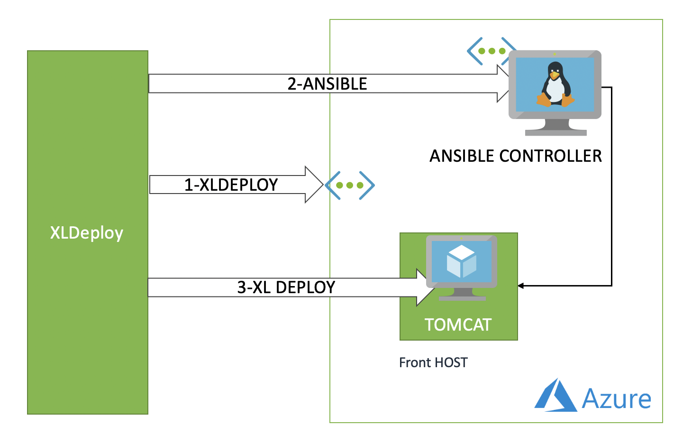
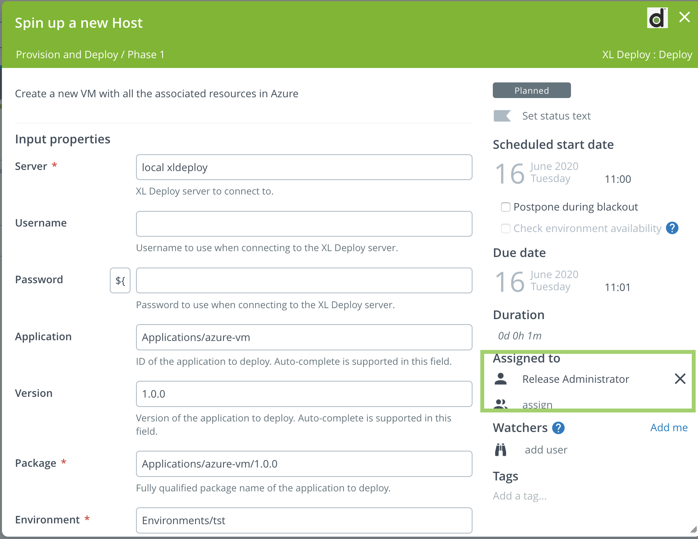
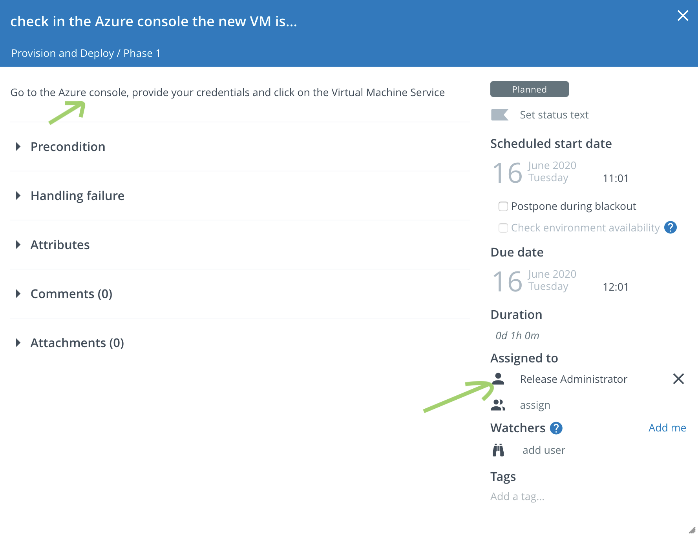
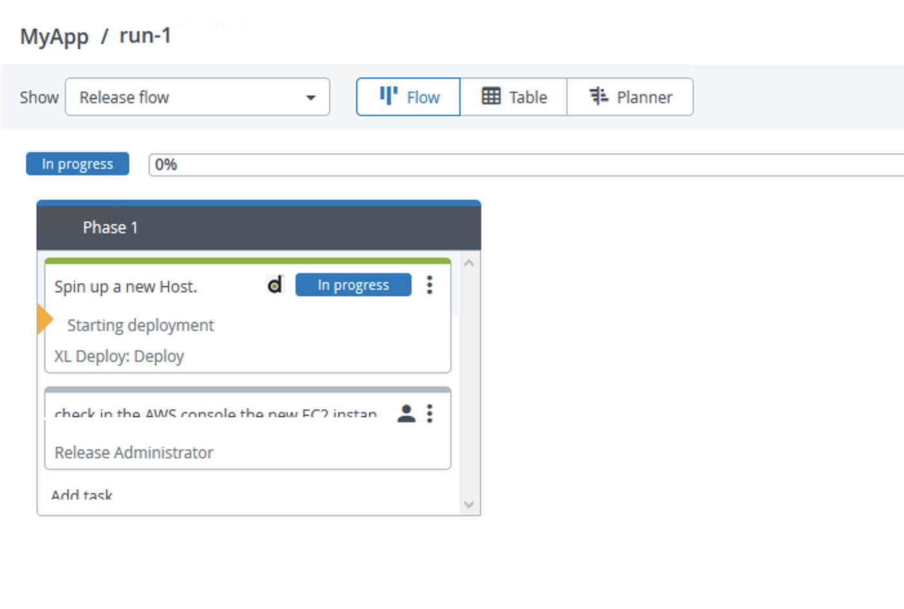
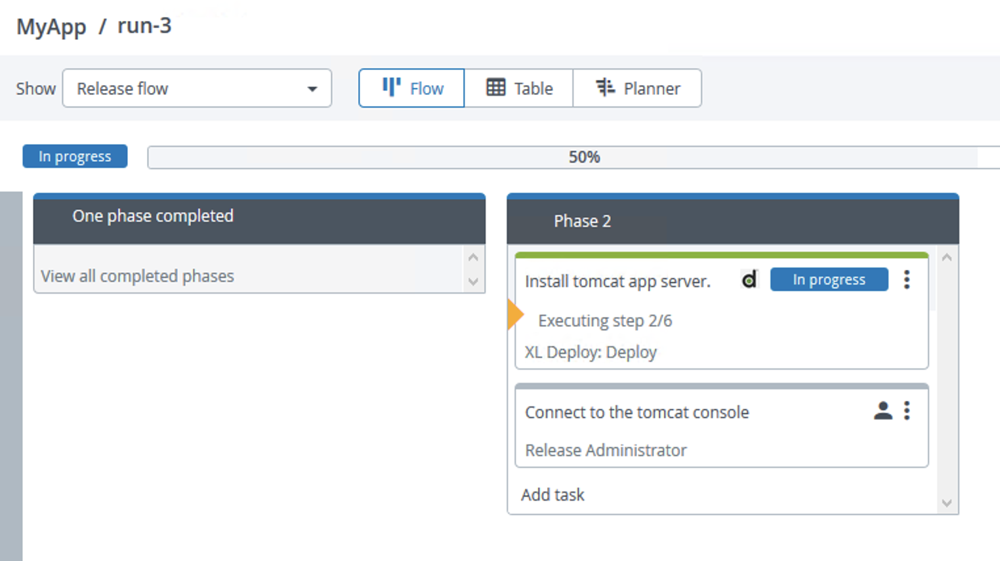
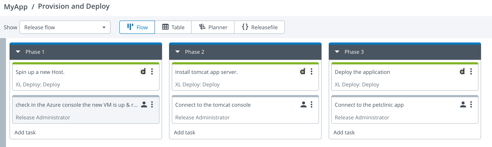
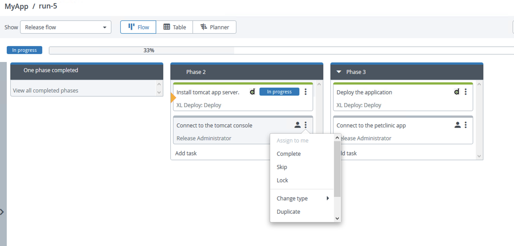
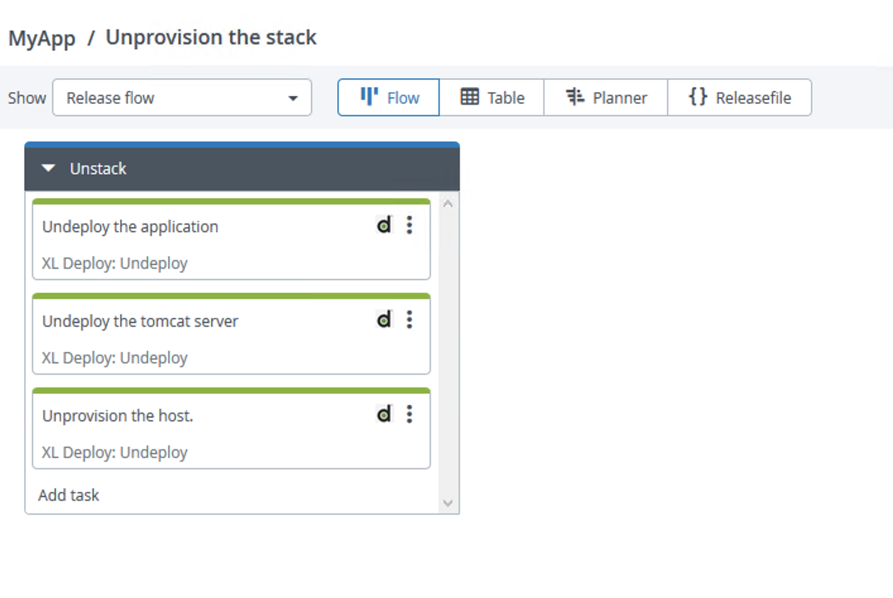

# Azure Workshop

## Steps

The workshop will setup the following stack using Microsoft Azure Cloud Services, Ansible, [XL Deploy](https://digital.ai/xl-deploy) and [XL Release](https://digital.ai/xl-release).



## Setup

on the machine running the XL Deploy Server. XLDeploy trial edition is available here: [https://info.digital.ai/xl-deploy-trial-free.html](https://info.digital.ai/xl-deploy-trial-free.html). Register, Download the zip file, unzip and lauch bin/run.sh  (or run.bat is your ruuning it from a Windows Machine). Documentation is available [here](https://docs.xebialabs.com/v.9.6/deploy/installation#get-started)

* install [xld-ansible-step-plugin](https://github.com/xebialabs-community/xld-ansible-step-plugin/releases/download/v1.1.0/xld-ansible-step-plugin-1.1.0.xldp) plugin. Copy the file into $XL_DEPLOY_HOME/plugins directory.
* install [overtherepy](https://github.com/xebialabs-community/overthere-pylib/releases/download/v0.0.4/overtherepy-0.0.4.jar) plugin. Copy the file into $XL_DEPLOY_HOME/plugins directory.
* restart XL Deploy Server
* install [XL-CLI](https://dist.xebialabs.com/public/xl-cli/9.6.2/) depending of the running platform (Linux,Windows or MacOS). Copy the file into $XL_DEPLOY_HOME/xl-cli directory.[Devops As Code Documentation](https://docs.xebialabs.com/v.9.6/xl-release/concept/get-started-with-devops-as-code#get-started)
* Fork or Download this repository. https://github.com/bmoussaud/xl-azure-workshop

### Provision a new resource group

* apply the Devops-as-code defintions containing the environment and infrastructure definition

```bash
xlw apply -f xebialabs/infrastructure.yaml
xlw apply -f xebialabs/environment.yaml
```

* edit the `Infrastructure/azure cloud connection` authMethod,subscriptionId,tenantId,clientId and clientKey properties with your Azure subscription settings. If you're using azure-cli you can find them in `~/.azure` folder.

* trigger the `check Connection` control task to validate the settings.

* apply the Devops-as-code defintions containing the deployment package for the resource group provisioning

```bash
xlw apply -f xebialabs/resource_group_provisioner.yaml
```

* deploy `Applications/ResourceGroupProvisioner/0.0.1` package in an environment containing an azure.Cloud Configuration item with your Azure credentials (`Environments/test/azure test`)

* Once deployed, in the Infrastructure, a new configuration item `Infrastructure/azure cloud connection/myResourceGroup`representing the resource groupe has been created under the azure.Cloud Configuration Item representing the new resource group.

### Provision the ansible controlleur in Azure

* apply the Devops-as-code defintions containing the deployment package for ansible controller

```bash
xlw apply -f xebialabs/azure_ansible_controller.yaml
```

* edit CI Applications/ansible-controller/1.0.0/ansible-host-template/ansible-controler-template, to modify devops properties to match your current environment (devopsAsCodeUrl & xlPath)

* deploy `Applications/ansible-controller/1.0.0` package in an environment containing an azure.Cloud Configuration item with your Azure credentials (`Environments/test/azure test`)

* Once deployed, in the Infrastructure,a new configuration item representing the resource has been created and added to the environment. It follows the following pattern 'Infrastructure/ansible-controlleur-{}-host'.

* trigger the `check Connection` control task.

### Provision a new target host in Azure

* apply the Devops-as-code defintions containing the deployment package containing the azure-vm package.

```bash
xlw apply -f xebialabs/azure_vm.yaml
```

* deploy `Applications/azure-vm/1.0.0` package in an environmnet containing an azure.Cloud Configuration item with your Azure credentials.
* Once deployed, in the Infrastructure, a new Configuration representing the new VM instance has been created and added to the environment. it follows the following pattern 'Infrastructure/{}-host'.
* trigger the `check Connection` control task to validate it.

Note: the `Applications/azure-vm/1.0.1` performs the same deployment but using a ARM template instead. The new created host will be put into a dedicated environment.

```bash
xlw apply -f xebialabs/application_tomcat.yaml
```

* deploy `Applications/java-server-application/0.1.1` package in the same environment.
* Once deployed, in the Infrastructure, 2 new configuration items representing the new `tomcat server` have been created and added to the environment. It follows the following pattern `Infrastructure/{}-host/tomcat-server` and `Infrastructure/{}-host/tomcat-server/tomcat.vh`

Note the `Applications/java-server-application/0.1.2` apply exactly the same role, except the devops as code definition is now externalized from the ansible role. It shows it easier to reuse existing ansible roles.

### Deploy the Web application

* Right-click on the `Applications` node, and select `import from XLDeploy Server`
* Select `PetClinic-war/1.0` package and click on the `Import` button
* Right-click on the `Applications` node, and select `import from XLDeploy Server`
* Select `PetClinic-war/2.0` package and click on the `Import` button
* Deploy `Applications/PetClinic-war/1.0` package in the same environment.
* Open a web browser to the `http://%IP_OF_AZURE_VM%/petclinic` address.
* Deploy `Applications/PetClinic-war/2.0` package in the same environment.
* Open a web browser to the `http://%IP_OF_AZURE_VM%/petclinic` address. Check the difference.

### Dump the state

* using the XL command line, you can dump the complete state of
  * the infrastructure `xlw generate xl-deploy -p Infrastructure -f infrastructure.yaml`
  * the applications `xlw generate xl-deploy -p Applications -f app.yaml`
  * the environments `xlw generate xl-deploy -p Environments -f env.yaml`

### Undeploy

* Undeploy the `PetClinic-war` app
  * Environments/test/azure test/PetClinic-war
* Undeploy the `java-server-application` app
  * Environments/test/azure test/java-server-application
* Undeploy the `azure-vm` app
  * Environments/test/azure test/azure-vm
* Undepoy the `ansible-controller` app (you'll need it during the orchestration section)
  * Environments/test/azure test/ansible-controller
* Undepoy the `ResourceGroupProvisioner` app (you'll need it during the orchestration section)
  * Environments/test/azure test/ResourceGroupProvisioner

### Orchestration - phase 1

XLRelease trial edition is available here: [https://info.digital.ai/xl-release-trial-free.html](https://info.digital.ai/xl-release-trial-free.html). Register, Download the zip file, unzip and lauch bin/run.sh  (or run.bat is your ruuning it from a Windows Machine). Documentation is available [here](https://docs.xebialabs.com/v.9.6/release/installation#get-started)

in XLRelease, we'll design a template to orchestrate the tasks to provision and to deploy a full stack.

* Click in Design and add a folder `MyApp`
* Click on the `Configuration` Tab and add an `XLDeploy Server`
  * title : local xldeploy
  * url: http://localhost:4516
  * authentication method: `basic`
  * provider username & password
  * click Test to validate the parameters
  * save.

* Add a Template, provide a name `Provision & Deploy`, Click on the create button
* Click on `New Phase` to rename it `Phase 1`
* Add Task, Select XLDeploy:Deploy, and provide a title, for example `Provision & Deploy`
  * Application: `Applications/azure-vm`
  * Version: `1.0.0`
  * Environment: Fill with an environment you used previously
  * Click on `Assign to me` link



* Add Task, Select Core:Manual, and provide a title, for example `check in the Azure console the new VM instance is up & ready`
  * Description: Go to the Azure console, provide your credential and click on the Compute Service.
  * Click on `Assign to me` link



* Create new release called `run-1`



* Go to XLDeploy, Montoring & Deployment task and check the new task has been executed.

### Orchestration - phase 2

* Go to `my app` folder and edit the template.
* Duplicate the `Phase 1` and rename it `Phase 2` by putting your mouse on the upper right side of the phase.
* Edit the deployment task with the following properties
  * Title: Install tomcat app server (open the task and click on the title task)
  * Application: Applications/java-server-application
  * Version: 0.1.1
* Edit the manual task with the following properties
  * Title: Connect to the tomcat console (open the task and click on the title task)
  * Description: using your browser, connect to <http://public_ip_of_machine:8080>
* Create new release called `run-3`



### Orchestration - phase 3

* Duplicate the `Phase 1` and rename it `Phase 3`
* Edit the deployment task with the following properties
  * Title: Deploy the application
  * Application: Applications/PetClinic-war
  * Version: 1.0
* Edit the manual task with the following properties
  * Title: Connect to the petclinic app
  * Description: using your browser, connect to <http://public_ip_of_machine:8080>



* Create new release called `run-5`
  * skip the 2 first manual tasks



### Orchestration - phase 4

Create a template that orchestrates 3 tasks to undeploy and to unprovision the stack.
Tips: use the `xldeploy:undeploy` task.



### Save your work as code

```bash
C:\xl-azure-workshop>xlw  --config config.yaml generate xl-release -t -o -p MyApp -f xebialabs/xlr_template_provision.yaml -n "Provision and Deploy"
Generating definitions for path MyApp from XL Release to xebialabs/xlr_template_provision.yaml
```

```bash
C:\xl-azure-workshop>xlw  --config config.yaml generate xl-release -t -o -p MyApp -f xebialabs/xlr_template_unprovision.yaml -n "Unprovision the stack"
Generating definitions for path MyApp from XL Release to xebialabs/xlr_template_unprovision.yaml
```
